# Balaji.dev – Portfolio

A modern, Apple-inspired portfolio built with Next.js, TypeScript, and Tailwind CSS. This project demonstrates a full transformation from a basic template to a visually unified, professional, and industry-standard portfolio.

---

## 🚀 Before & After

| Before (Sprint_1) | After (Current) |
|-------------------|----------------|
| 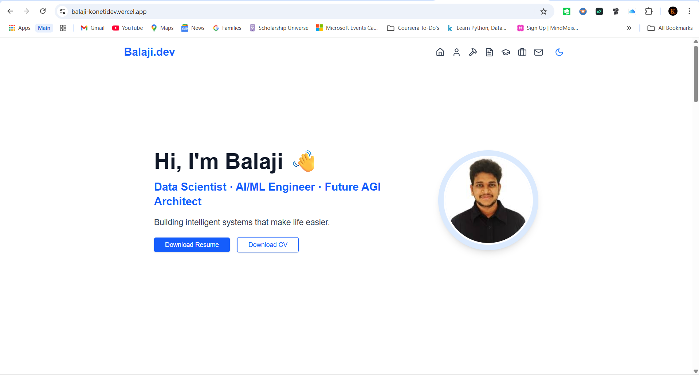 |  |
| 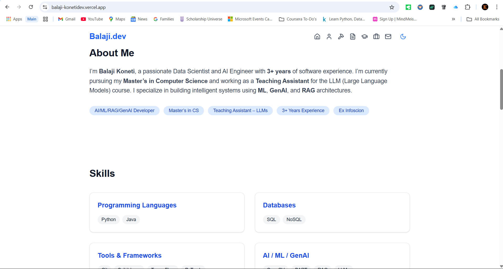 | 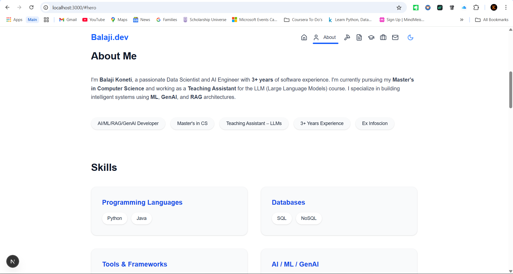 |
| 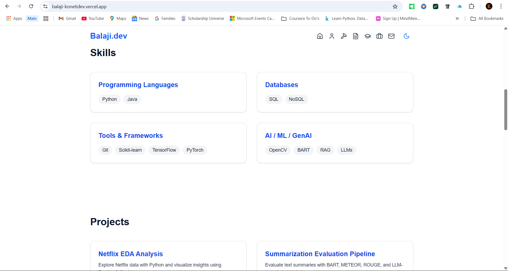 | 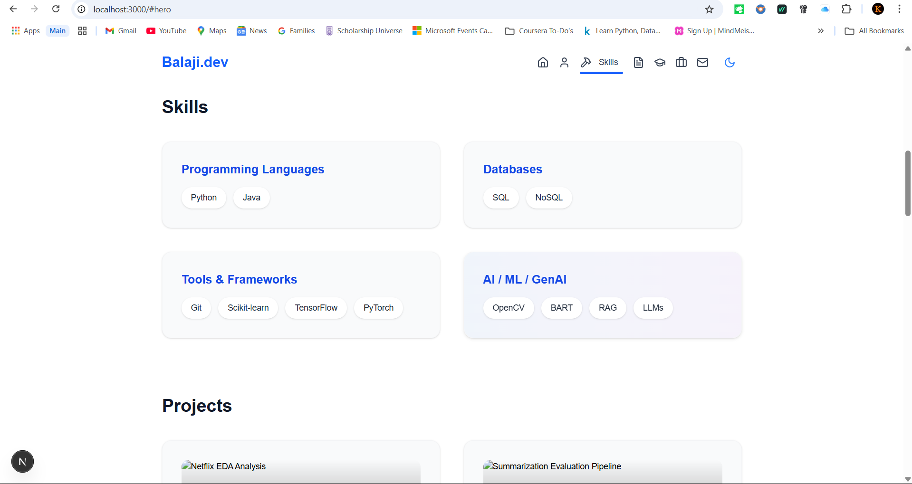 |
| 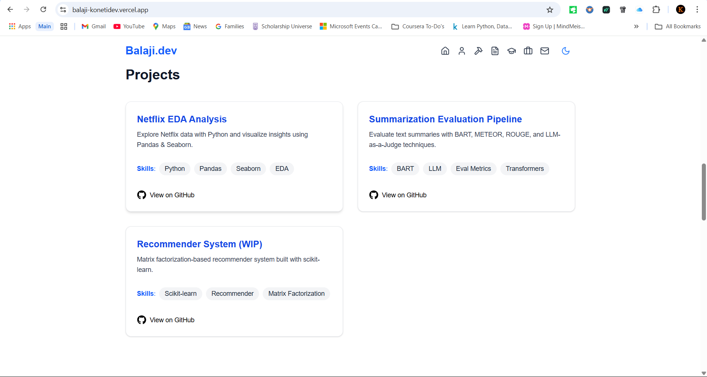 | 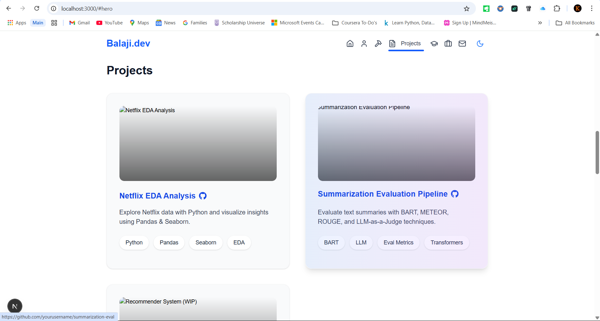 |
|  | 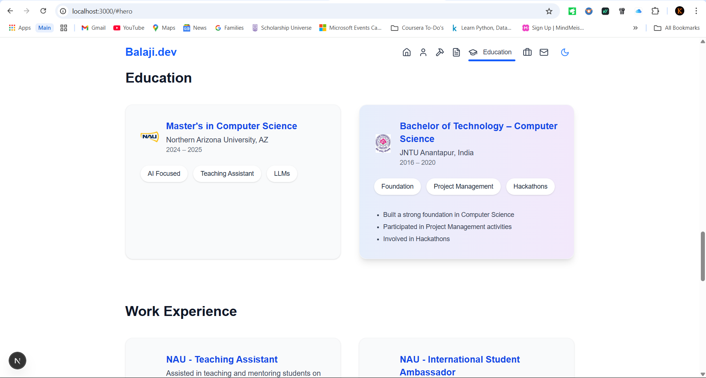 |
| 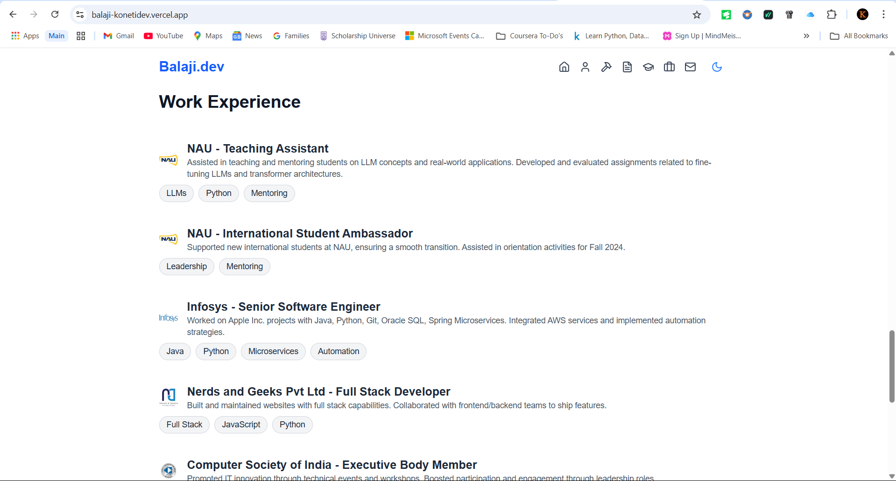 | 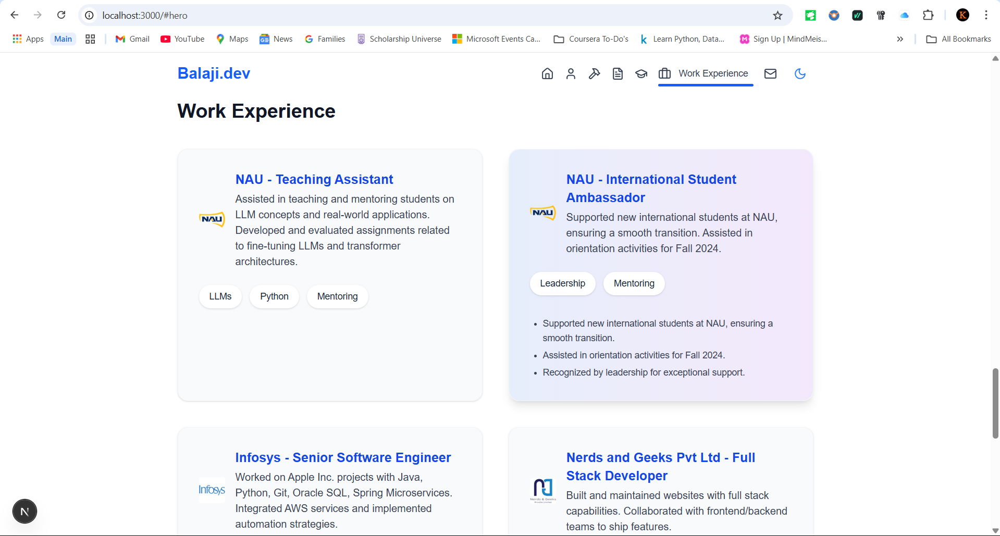 |
| 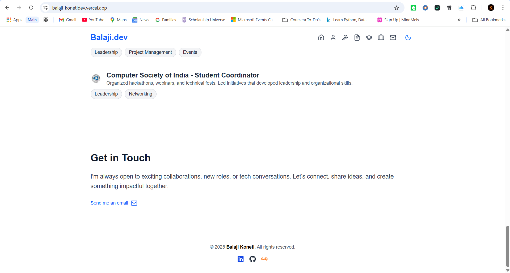 | 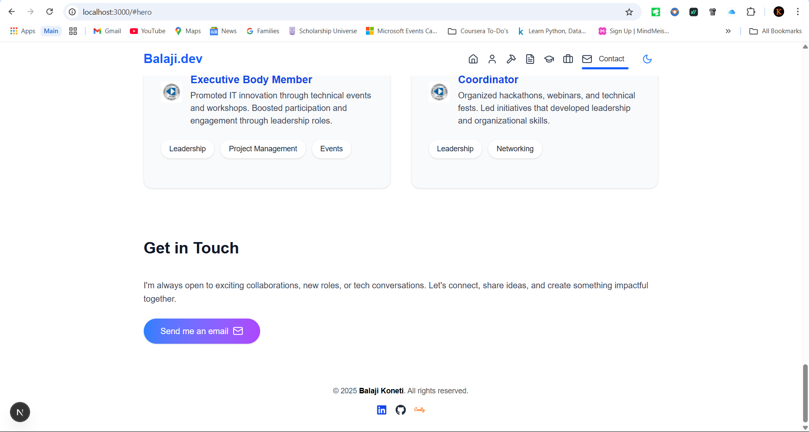 |
| 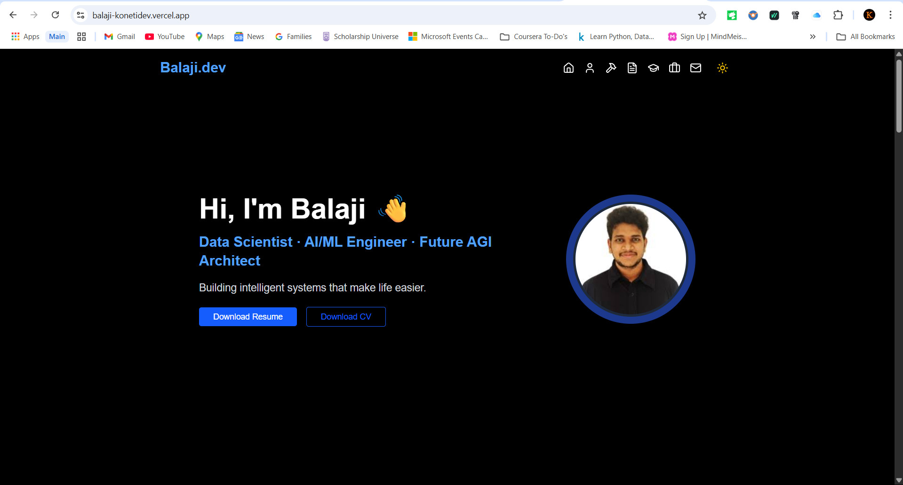 |  |

---

## 🗂️ Project Structure

```
.
├── public/
│   └── profile.jpg, [after images]
├── src/
│   ├── app/
│   ├── components/
│   ├── styles/
│   └── ...
├── Sprint_1/
│   └── [before images]
├── tailwind.config.js
├── package.json
└── README.md
```

---

## 🛠️ How to Run

1. **Install dependencies:**
   ```bash
   npm install
   ```
2. **Start the development server:**
   ```bash
   npm run dev
   ```
3. **Open [http://localhost:3000](http://localhost:3000) in your browser.**

---

## ✨ Section-by-Section Improvements

### Hero Section
- **Before:** 
- **After:** 
- **Changes:**  
  - Centered layout, larger profile image, animated gradient ring, Apple-style typography, animated intro text.

### About Section
- **Before:** 
- **After:** 
- **Changes:**  
  - Unified card/tag styles, improved spacing, modern Apple-inspired look.

### Skills Section
- **Before:** 
- **After:** 
- **Changes:**  
  - Consistent card/tag styles, gradient overlays, hover effects, unified with Projects section.

### Projects Section
- **Before:** 
- **After:** 
- **Changes:**  
  - Apple-style cards, gradient overlays, smooth hover, unified tag/button styles, clickable project titles/icons.

### Education Section
- **Before:** 
- **After:** 
- **Changes:**  
  - Card-based layout, gradient overlays, unified tag styles, expand/collapse transitions.

### Work Experience Section
- **Before:** 
- **After:** 
- **Changes:**  
  - Card-based layout, gradient overlays, unified tag styles, expand/collapse transitions.

### Contact Section
- **Before:** 
- **After:** 
- **Changes:**  
  - Minimal, clean, prominent call-to-action, gradient button, unified button size and style.

### NavBar & Footer
- **Before:** 
- **After:** 
- **Changes:**  
  - Fixed, minimal NavBar, animated underline, accessible, responsive hamburger menu, consistent accent color, minimal footer.

---

## 🧑‍💻 Tech Stack

- Next.js 15
- TypeScript
- Tailwind CSS 4
- Framer Motion
- next-themes (dark mode)
- Lucide React Icons

---

## 🙏 Credits & Inspiration

- Inspired by Apple.com, Vercel, and top industry portfolios.

---

**Clone, run, and enjoy a truly modern, Apple-inspired portfolio!**
